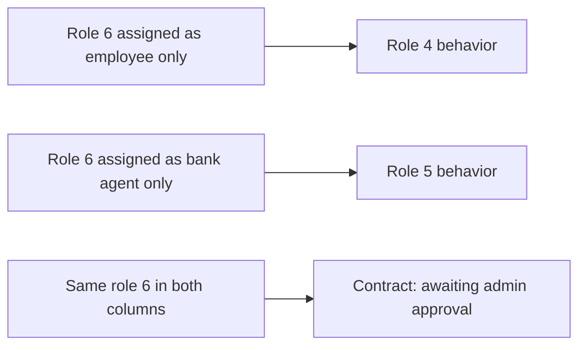

# Dual Role 6 Access Plan

## Product Rule

Role 6 is a dual-capability user, not a global shortcut. The user can appear in either assignment column:

- Employee column: behaves like role 4 for that customer/request.
- Bank-agent column: behaves like role 5 and must have `assigned_bank_id` bank scope.
- Both columns with the same role 6 user: contracts created by that user skip bank-agent approval and go directly to admin approval.

## Implementation Approach

- Add role 6 in a new migration and seed role permissions as the union of role 4 and role 5 where permissions are used.
- Add capability helpers instead of scattering raw `roleId === 6` checks:
  - `isEmployeeAssignableRole(roleId)` for employee-column eligibility: roles 3/4 plus 6 where appropriate.
  - `isBankAgentAssignableRole(roleId)` for bank-agent-column eligibility: roles 5 plus 6.
  - `isDualRole(roleId)` for role 6 only.
  - `isSameUserAssignedBothColumns(...)` for the contract skip decision.
- Keep role 4 and role 5 behavior unchanged. Role 6 only gets dual behavior when assignment data says it should.

## Files To Change

- [migrations](migrations): add a migration for role 6 and role permissions.
- [src/notification-access.ts](src/notification-access.ts): centralize role normalization/capability helpers and extend customer/request access checks to support role 6 via either column.
- [src/index.tsx](src/index.tsx): update user create/update validation, assignment APIs, dropdown SQL, customer/request list filters, bank-agent validation, and admin route allowlists.
- [src/contracts-module-api.ts](src/contracts-module-api.ts): enforce the contract approval rule on the server. On create, role 6 only skips bank approval if the same user is assigned as both employee and bank agent for the selected customer/request; otherwise it follows the relevant normal role 4/5 behavior.
- [src/contracts-module/new-contract.html](src/contracts-module/new-contract.html), [src/contracts-module/contracts.html](src/contracts-module/contracts.html), [src/contracts-module/contract-view.html](src/contracts-module/contract-view.html), and [src/contracts-module/js/app.js](src/contracts-module/js/app.js): update UI visibility/status messaging for role 6.
- [src/contracts-module-pages/generated](src/contracts-module-pages/generated): regenerate generated contract pages from the source HTML.
- [src/full-admin-panel.ts](src/full-admin-panel.ts): allow role 6 to see the right dashboard links and appear in both employee and bank-agent selectors.

## Contract Approval Logic

Server-side behavior in [src/contracts-module-api.ts](src/contracts-module-api.ts):

- Role 4 creates: `بانتظار موافقة ممثل البنك`.
- Role 5 cannot create as employee unless assigned through the role 5 path that already exists.
- Role 6 creates while assigned only as employee: `بانتظار موافقة ممثل البنك`.
- Role 6 creates while assigned as both employee and bank agent for the same customer/request: `بانتظار موافقة الإدارة`, with bank approval audit fields set to that user/time for traceability.
- Role 6 assigned only as bank agent can approve another employee's `بانتظار موافقة ممثل البنك` contract like role 5.
- Admin approval remains roles 1/2 only.

## Assignment Logic

- Employee assignment API will allow role 6 in the employee column.
- Bank-agent assignment API will allow role 6 in the bank-agent column only if the user is active, tenant-valid, and bank-scoped like role 5.
- Dropdowns will include role 6 in both selectors, but assignment choice determines behavior.
- Auto-distribution queues should remain role 4-only unless explicitly changed later, so role 6 users are not automatically consumed as generic employees.

## Tests

Add focused tests for:

- Role 6 can be assigned as employee, bank agent, or both.
- Role 6 cannot be used as bank agent without valid bank scope.
- Contract created by role 6 assigned only as employee waits for bank-agent approval.
- Contract created by role 6 assigned in both columns skips to admin approval.
- Role 6 assigned only as bank agent can approve another employee's pending bank-agent contract.
- Existing role 4 and role 5 approval flows remain unchanged.