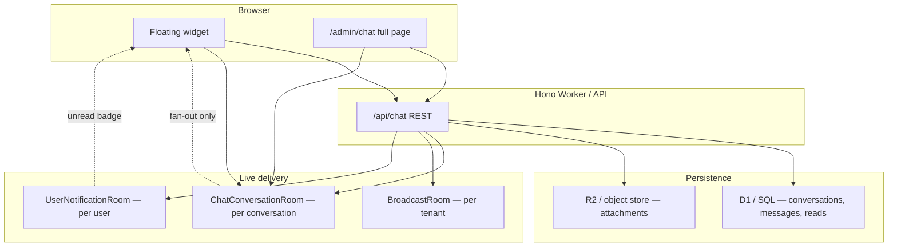

# Portable Internal Chat — Implementation Guide

This document describes the **company internal chat** built in Expense-Master so you can replicate the same feature set in another TypeScript project (e.g. logistics). It covers architecture, data model, API contracts, real-time delivery, UI patterns, and security.

**Scope:** tenant-scoped 1:1 messaging, company broadcasts, attachments, replies, forward, soft-delete, unread badges, floating widget + full-page chat, and optional admin read-only oversight.

**Out of scope (finance-specific — do not copy):** customer `@` tagging, `chat_message_customer_tags`, `GET /api/chat/customers/search`, and RBAC tied to customer assignments. See [§12 Optional entity tagging](#12-optional-entity-tagging-logistics-adaptation) if you want an equivalent for shipments/orders.

---

## Table of contents

1. [Reference files in this repo](#1-reference-files-in-this-repo)
2. [Architecture](#2-architecture)
3. [What to copy vs skip](#3-what-to-copy-vs-skip)
4. [Data model (SQL)](#4-data-model-sql)
5. [Backend module](#5-backend-module)
6. [REST API reference](#6-rest-api-reference)
7. [WebSocket events](#7-websocket-events)
8. [Durable Objects & deployment](#8-durable-objects--deployment)
9. [Attachments & images (R2)](#9-attachments--images-r2)
10. [Security & access control](#10-security--access-control)
11. [Frontend: widget + full page](#11-frontend-widget--full-page)
12. [Optional entity tagging (logistics adaptation)](#12-optional-entity-tagging-logistics-adaptation)
13. [Phased implementation checklist](#13-phased-implementation-checklist)
14. [Adapting off Cloudflare](#14-adapting-off-cloudflare)
15. [Known UX gaps (not in Expense-Master yet)](#15-known-ux-gaps-not-in-expense-master-yet)

---

## 1. Reference files in this repo

| File | Purpose |
|------|---------|
| `src/chat-module-api.ts` | All REST routes, access checks, message CRUD, forward/delete, DO classes |
| `src/chat-widget.ts` | Bottom-right floating chat (HTML/CSS/JS string) |
| `src/chat-page.ts` | Full-screen `/admin/chat` two-column layout |
| `src/chat-do-worker.ts` | Standalone Worker that hosts DO classes (Pages cannot export DOs) |
| `migrations/0078_company_chat.sql` | Core tables |
| `migrations/0082_chat_broadcasts.sql` | Broadcast channel |
| `migrations/0084_chat_messages_forwarded.sql` | `is_forwarded` column |
| `migrations/0085_chat_messages_reply.sql` | `replied_to_message_id` column |
| `migrations/0083_chat_message_customer_tags.sql` | **Finance-only — skip** |
| `wrangler.chat-do.toml` | Deploy DO Worker |
| `wrangler.jsonc` | Pages → DO bindings via `script_name` |
| `tests/chat-*.test.ts` | Isolation, forward, delete, broadcasts |

Design notes (product decisions, not code):

- `company-chat-system-plan.md` — original architecture plan
- `company-chat-select-forward.md` — select / delete / forward UX rules
- `company-chat-admin-drilldown.md` — admin oversight flow

---

## 2. Architecture



**Principle:** SQL is the **source of truth**. Durable Objects (or equivalent pub/sub) only **fan out events** to connected browsers. On refresh or reconnect, history always comes from the database.

**Three WebSocket channels:**

| Channel | URL | DO instance key | Purpose |
|---------|-----|-----------------|---------|
| Conversation | `GET /api/chat/ws/:conversationId` | `conv:{conversationId}` | New messages, tombstones in open thread |
| Broadcasts | `GET /api/chat/broadcasts/ws` | `broadcast:{tenantId}` | New/deleted broadcast messages |
| Unread badge | `GET /api/chat/notify/ws` | `user:{userId}` | Push `{ type: 'unread_update' }` when recipient gets a message |

**Polling fallbacks (client):**

- Thread: `GET .../messages?after={lastSeenId}` every **4 seconds** while a conversation is open
- Conversation list: reload every **10 seconds** (widget schedules recursive timeout; full page uses `setInterval`)
- Notify WS uses exponential backoff reconnect (cap 30s)

---

## 3. What to copy vs skip

### Copy (core product)

| Feature | Notes |
|---------|-------|
| 1:1 direct chat | Unique conversation per user pair per tenant |
| Conversation list + unread counts | `chat_message_reads` cursor per user per conversation |
| Text messages | Max 8000 chars |
| File attachments | Images, PDF, Office docs; 10 MB cap |
| Reply to message | `replied_to_message_id` + inline preview |
| Forward messages | Multi-select → multi-recipient; copies attachments in R2 |
| Soft delete (tombstone) | Sender-only; body cleared; `created_at` kept |
| Company broadcasts | Admin-only post; all tenant users read |
| Floating widget + full page | Same API; expand link to full page |
| Real-time + polling | WS primary, HTTP poll backup |
| Admin oversight (optional) | Read-only drill-down: user → their conversations → thread |

### Skip (finance / Expense-Master specific)

| Item | Why |
|------|-----|
| `chat_message_customer_tags` table | Tags customers in messages |
| `GET /api/chat/customers/search` | Customer typeahead for `@` mentions |
| `customer_ids` on `POST .../messages` | Links message to CRM customers |
| `canUserAccessCustomer` / role 4/5 assignment scoping | Expense app RBAC |
| Per-viewer `can_link` on tags | Finance privacy model |
| WS tag re-fetch after live message | Only needed for per-viewer tag links |

When porting, remove `customer_ids` from the send payload, drop tag tables/queries, and strip `@` mention UI from the composer.

---

## 4. Data model (SQL)

### 4.1 Core (required)

```sql
-- One row per unique pair of users within a tenant.
-- participant_one_id < participant_two_id (enforced in app via orderedPair()).
CREATE TABLE chat_conversations (
  id INTEGER PRIMARY KEY AUTOINCREMENT,
  tenant_id INTEGER NOT NULL,
  participant_one_id INTEGER NOT NULL,
  participant_two_id INTEGER NOT NULL,
  last_message_id INTEGER,
  last_message_at TEXT,
  created_at TEXT NOT NULL DEFAULT CURRENT_TIMESTAMP,
  updated_at TEXT NOT NULL DEFAULT CURRENT_TIMESTAMP,
  UNIQUE (tenant_id, participant_one_id, participant_two_id)
);

CREATE INDEX idx_chat_conversations_tenant ON chat_conversations(tenant_id);
CREATE INDEX idx_chat_conversations_p1 ON chat_conversations(tenant_id, participant_one_id);
CREATE INDEX idx_chat_conversations_p2 ON chat_conversations(tenant_id, participant_two_id);

CREATE TABLE chat_messages (
  id INTEGER PRIMARY KEY AUTOINCREMENT,
  conversation_id INTEGER NOT NULL,
  tenant_id INTEGER NOT NULL,
  sender_id INTEGER NOT NULL,
  body TEXT,
  attachment_json TEXT,          -- JSON: { key, name, mime, size }
  deleted_at TEXT,
  is_forwarded INTEGER NOT NULL DEFAULT 0,
  replied_to_message_id INTEGER, -- nullable FK to chat_messages.id
  created_at TEXT NOT NULL DEFAULT CURRENT_TIMESTAMP
);

CREATE INDEX idx_chat_messages_conv ON chat_messages(conversation_id, created_at);
CREATE INDEX idx_chat_messages_tenant ON chat_messages(tenant_id);

-- Per-user read cursor for unread counts.
CREATE TABLE chat_message_reads (
  conversation_id INTEGER NOT NULL,
  user_id INTEGER NOT NULL,
  last_read_message_id INTEGER NOT NULL DEFAULT 0,
  last_read_at TEXT NOT NULL DEFAULT CURRENT_TIMESTAMP,
  PRIMARY KEY (conversation_id, user_id)
);

CREATE INDEX idx_chat_message_reads_user ON chat_message_reads(user_id);
```

### 4.2 Broadcasts (optional but recommended)

```sql
CREATE TABLE chat_broadcasts (
  id INTEGER PRIMARY KEY AUTOINCREMENT,
  tenant_id INTEGER NOT NULL,
  sender_id INTEGER NOT NULL,
  body TEXT NOT NULL,
  deleted_at TEXT,
  created_at TEXT NOT NULL DEFAULT CURRENT_TIMESTAMP
);

CREATE INDEX idx_chat_broadcasts_tenant ON chat_broadcasts(tenant_id, created_at DESC);

CREATE TABLE chat_broadcast_reads (
  user_id INTEGER NOT NULL PRIMARY KEY,
  tenant_id INTEGER NOT NULL,
  last_read_broadcast_id INTEGER NOT NULL DEFAULT 0,
  last_read_at TEXT NOT NULL DEFAULT CURRENT_TIMESTAMP
);
```

### 4.3 `attachment_json` shape

```json
{
  "key": "chat/{tenantId}/{conversationId}/{messageId}/{safeFilename}",
  "name": "invoice.pdf",
  "mime": "application/pdf",
  "size": 123456
}
```

### 4.4 Unread count logic

For conversation `C` and user `U`:

```sql
SELECT COUNT(*) FROM chat_messages cm
LEFT JOIN chat_message_reads cmr
  ON cmr.conversation_id = cm.conversation_id AND cmr.user_id = :userId
WHERE cm.conversation_id = :convId
  AND cm.sender_id != :userId
  AND cm.deleted_at IS NULL
  AND cm.id > COALESCE(cmr.last_read_message_id, 0)
```

Broadcast unread: count rows in `chat_broadcasts` where `id > last_read_broadcast_id` and `deleted_at IS NULL`.

---

## 5. Backend module

### 5.1 Registration pattern

```typescript
import { registerChatModuleApi } from './chat-module-api'

registerChatModuleApi(app, getUserInfo)
```

`getUserInfo(c)` must return at minimum:

```typescript
{ userId: number | null, tenantId: number | null, roleId: number | null }
```

### 5.2 Required bindings (Cloudflare)

```typescript
type Env = {
  DB: D1Database
  ATTACHMENTS: R2Bucket
  CHAT_ROOMS: DurableObjectNamespace
  USER_NOTIFICATIONS: DurableObjectNamespace
  BROADCAST_ROOMS: DurableObjectNamespace
}
```

### 5.3 Core helpers

**`orderedPair(a, b)`** — always store `(min, max)` as `(participant_one_id, participant_two_id)` so the unique constraint works regardless of who initiates the chat.

**`ensureConversationAccess(db, conversationId, userId, tenantId)`** — caller must be a participant and `tenant_id` must match. Used for **write** operations (send, delete own messages, mark read).

**`ensureConversationReadAccess(..., roleId)`** — same as above, but if admin drill-down is enabled, role 2 (company admin) may **read** any same-tenant conversation. Used for GET messages, attachments, WebSocket connect.

### 5.4 Constants

```typescript
const ADMIN_ROLE_ID = 2                    // who can post broadcasts
const MAX_ATTACHMENT_BYTES = 10 * 1024 * 1024
const ALLOWED_MIME_PREFIXES = [
  'image/',
  'application/pdf',
  'application/msword',
  'application/vnd.openxmlformats-officedocument',
  'text/plain',
]
export const CHAT_ADMIN_DRILLDOWN_ENABLED = false  // flip to enable oversight UI
```

### 5.5 After every outbound message

1. Insert row in `chat_messages` (or `chat_broadcasts`)
2. Update `chat_conversations.last_message_id` / `last_message_at`
3. `broadcastToRoom` (direct) or `broadcastToTenant` (broadcasts)
4. `pushUserNotification(recipientUserId)` for badge updates

Use `executionCtx.waitUntil()` so the HTTP response is not blocked by fan-out.

### 5.6 Date & time conventions (backend)

Chat stores all **application-written** timestamps as **UTC ISO 8601 strings** via `new Date().toISOString()` (e.g. `2026-06-11T10:05:00.000Z`). The server **never** formats dates for display — clients receive raw strings and localize in the browser.

| Column / field | Table | Written when | Format |
|----------------|-------|--------------|--------|
| `created_at` | `chat_messages`, `chat_broadcasts`, `chat_conversations` | Insert message, conversation, broadcast | `toISOString()` |
| `updated_at` | `chat_conversations` | New message in thread | `toISOString()` |
| `last_message_at` | `chat_conversations` | New message or attachment | `toISOString()` |
| `deleted_at` | `chat_messages`, `chat_broadcasts` | Soft delete | `toISOString()` |
| `last_read_at` | `chat_message_reads`, `chat_broadcast_reads` | Mark read | `toISOString()` |

**SQLite defaults:** columns also declare `DEFAULT CURRENT_TIMESTAMP`, which yields `YYYY-MM-DD HH:MM:SS` **without** a timezone suffix if a row is inserted without an explicit timestamp. In practice every chat write path in `chat-module-api.ts` passes an explicit ISO string, so API responses are consistently `...Z`.

**Sorting & pagination:**

- Message history is ordered by **`id`** (monotonic), not `created_at`. Pagination cursors (`before`, `after`) use message ids.
- Conversation list is ordered by `COALESCE(last_message_at, created_at) DESC`.

**Not used in chat:**

- No Hijri calendar (unlike `formatWorkflowActionTimestamp()` in `notification-access.ts`).
- No fixed `Asia/Riyadh` timezone on the server (unlike `formatKsaDateTime()` in `workflow-page.ts`). Display timezone is entirely client-side.

**Portable rule:** always write UTC ISO from the server; parse with `new Date(isoString)` on the client. If your app standardizes on KSA everywhere else, apply `timeZone: 'Asia/Riyadh'` in client formatters — chat does not do this today.

### 5.7 Reply threading (backend)

Requires migration `0085_chat_messages_reply.sql`:

```sql
ALTER TABLE chat_messages ADD COLUMN replied_to_message_id INTEGER;
```

There is no formal SQL foreign-key constraint; integrity is enforced in the send handler.

**Send (`POST .../messages`):**

1. Optional body field: `replied_to_message_id` (number).
2. Validation query:

```sql
SELECT id FROM chat_messages
WHERE id = ? AND conversation_id = ? AND deleted_at IS NULL
LIMIT 1
```

3. If the id is missing, wrong conversation, or deleted → **reply link is silently dropped** (message still sends as a normal message; no 400 error).
4. Insert includes `replied_to_message_id` when valid; falls back to insert without the column if migration 0085 is not applied.
5. After insert, server fetches the referenced row and builds `reply_preview` for the HTTP response and WebSocket payload.

**`reply_preview` object (server-built):**

```json
{
  "id": 98,
  "sender_id": 3,
  "body": "Original text or null if deleted",
  "attachment_json": "{...} or null if deleted",
  "deleted_at": null
}
```

If the parent message was deleted after this reply was sent, history still returns `reply_preview` with `body: null`, `attachment_json: null`, and `deleted_at` set.

**History (`GET .../messages`):**

`buildMessageHistory()` collects all non-deleted `replied_to_message_id` values in the page, batch-loads parent rows via `loadReplyPreviews()`, and attaches `reply_preview` to each reply. Deleted messages in the page are tombstoned (no body/attachment/tags) but keep `created_at`.

**WebSocket:** `message` events include `replied_to_message_id` and `reply_preview` when present (same shape as REST).

**What does NOT support replies:**

| Action | Reply support |
|--------|----------------|
| `POST .../messages` (text) | Yes — `replied_to_message_id` |
| `POST .../attachments` | **No** — separate endpoint; no reply field |
| `POST .../messages/forward` | **No** — forwarded rows copy body/attachment only |
| Broadcasts (`chat_broadcasts`) | **No** — no `replied_to_message_id` column |

**Reference:** `fetchMessageRows()`, `loadReplyPreviews()`, `buildMessageHistory()`, send handler ~lines 780–859 in `src/chat-module-api.ts`.

---

## 6. REST API reference

All routes require an authenticated session. Responses use `{ success: boolean, ... }`.

### 6.1 Users & conversations

#### `GET /api/chat/users`

List active users in the same tenant (excluding self).

**Response:**

```json
{
  "success": true,
  "users": [{ "id": 3, "name": "Ahmed", "email": "a@co.com", "role_id": 4 }]
}
```

#### `GET /api/chat/conversations`

Current user's threads, newest first, plus broadcast unread count.

**Response:**

```json
{
  "success": true,
  "broadcast_unread_count": 2,
  "conversations": [{
    "id": 12,
    "other_user": { "id": 3, "name": "Ahmed", "email": "...", "role_id": 4 },
    "last_message": {
      "id": 99,
      "sender_id": 3,
      "body": "Hello",
      "attachment_json": null,
      "created_at": "2026-06-11T10:00:00.000Z",
      "deleted_at": null
    },
    "last_message_at": "2026-06-11T10:00:00.000Z",
    "unread_count": 1
  }]
}
```

#### `POST /api/chat/conversations/direct`

Create or return existing 1:1 conversation.

**Body:** `{ "user_id": 3 }`

**Response:** `{ "success": true, "conversation_id": 12 }`

### 6.2 Messages

#### `GET /api/chat/conversations/:id/messages`

Paginated history. Participant or admin (read access) only.

| Query | Behavior |
|-------|----------|
| (none) | Latest `limit` messages (default 50, max 200), ascending order in response |
| `before={messageId}` | Older page: messages with `id < before`, DESC then reversed |
| `after={messageId}` | New messages since id (for polling / catch-up) |
| `limit` | Page size |

**Message object (portable subset):**

```json
{
  "id": 100,
  "sender_id": 2,
  "body": "See attached",
  "attachment_json": null,
  "created_at": "2026-06-11T10:05:00.000Z",
  "deleted_at": null,
  "is_forwarded": 0,
  "replied_to_message_id": 98,
  "reply_preview": {
    "id": 98,
    "sender_id": 3,
    "body": "Original text",
    "attachment_json": null,
    "deleted_at": null
  }
}
```

#### `POST /api/chat/conversations/:id/messages`

Send text.

**Body (portable):**

```json
{
  "body": "Message text",
  "replied_to_message_id": 98
}
```

>Omit `customer_ids` when porting.

**Response:** `{ "success": true, "message": { ... } }`

Validation: non-empty body, max 8000 chars; `replied_to_message_id` must exist in same conversation and not be deleted.

#### `POST /api/chat/conversations/:id/read`

Update read cursor.

**Body:** `{ "last_read_message_id": 100 }`

Uses `MAX(existing, incoming)` on conflict.

#### `POST /api/chat/conversations/:id/messages/delete`

Tombstone messages **sent by caller only**.

**Body:** `{ "message_ids": [100, 101] }`

**Response:** `{ "success": true, "deleted_ids": [100] }`

Side effects: clears `body` and `attachment_json`, sets `deleted_at`, deletes R2 object if present, broadcasts `message_deleted` on conversation WS.

### 6.3 Attachments

#### `POST /api/chat/conversations/:id/attachments`

`multipart/form-data` with field `file`.

Flow:

1. Insert placeholder message with `attachment_json: '{}'`
2. Upload to object store at `chat/{tenantId}/{conversationId}/{messageId}/{safeName}`
3. Update `attachment_json` with metadata
4. Broadcast `message` event

#### `GET /api/chat/attachments/:conversationId/:messageId/:filename`

Authenticated download/stream. Never expose raw object-store URLs to the client.

Query `?dl=1` for `Content-Disposition: attachment`.

### 6.4 Forward

#### `POST /api/chat/messages/forward`

**Body:**

```json
{
  "source_type": "direct",
  "source_conversation_id": 12,
  "message_ids": [100, 101],
  "recipient_user_ids": [3, 5]
}
```

For broadcasts: `"source_type": "broadcast"`, omit `source_conversation_id`.

**Behavior:**

- Validates caller can access source (participant for direct)
- Rejects deleted source messages
- For each recipient in same tenant: get or create direct conversation with caller
- For each source message: insert new row with `is_forwarded = 1`
- Attachments: **copy** R2 object to new key under target conversation (do not share keys)
- Broadcast each new message + notify recipients

**Response:** `{ "success": true }`

### 6.5 Broadcasts

| Method | Path | Who | Purpose |
|--------|------|-----|---------|
| GET | `/api/chat/broadcasts/messages` | All tenant users | List/poll (`?after=`) |
| POST | `/api/chat/broadcasts/messages` | Role 2 admin | Post announcement |
| POST | `/api/chat/broadcasts/read` | All | `{ last_read_broadcast_id }` |
| GET | `/api/chat/broadcasts/unread` | All | Unread count |
| POST | `/api/chat/broadcasts/messages/delete` | Sender only | Tombstone |
| GET | `/api/chat/broadcasts/ws` | All | Live WS |

Broadcast messages include `sender_name` in the UI (fetched server-side or joined on list).

### 6.6 Admin oversight (optional)

Enabled when `CHAT_ADMIN_DRILLDOWN_ENABLED === true` and caller `role_id === 2`.

#### `GET /api/chat/admin/users/:userId/conversations`

Lists conversations where **target user** is a participant. Response shape similar to `GET /conversations` but `other_user` is relative to the **target**, not the admin.

Admin may `GET .../messages` and `GET .../attachments` and open WS for read-only live view. **POST** send/attachment/read remain participant-only.

### 6.7 Finance-only (do not port)

- `GET /api/chat/customers/search?q=&limit=`

---

## 7. WebSocket events

### 7.1 Conversation room (`/api/chat/ws/:conversationId`)

**Server → client:**

```json
{ "type": "message", "message": { "id": 100, "sender_id": 2, "body": "...", "attachment_json": null, "created_at": "..." } }
```

```json
{ "type": "message_deleted", "message_ids": [100], "conversation_id": 12 }
```

**Client behavior:**

- On `message`: append if `id` not already rendered; call `POST .../read` with latest id
- On `message_deleted`: replace bubble with tombstone UI (keep timestamp)

**Reconnect:** exponential backoff; on open reset retry counter.

### 7.2 Broadcast room (`/api/chat/broadcasts/ws`)

```json
{ "type": "broadcast", "message": { "id": 5, "sender_id": 2, "body": "...", "sender_name": "Admin", "created_at": "..." } }
```

```json
{ "type": "broadcast_deleted", "message_ids": [5] }
```

### 7.3 User notification (`/api/chat/notify/ws`)

```json
{ "type": "unread_update" }
```

Client reloads `GET /api/chat/conversations` to refresh badge on launcher.

---

## 8. Durable Objects & deployment

Cloudflare Pages **cannot** export Durable Object classes from the Pages bundle. This project uses a **separate Worker**:

1. `src/chat-do-worker.ts` re-exports `ChatConversationRoom`, `UserNotificationRoom`, `BroadcastRoom`
2. Deploy with `wrangler.chat-do.toml` → Worker name e.g. `tamweel-chat-do`
3. `wrangler.jsonc` binds DO namespaces to that script:

```jsonc
"durable_objects": {
  "bindings": [
    { "name": "CHAT_ROOMS", "class_name": "ChatConversationRoom", "script_name": "tamweel-chat-do" },
    { "name": "USER_NOTIFICATIONS", "class_name": "UserNotificationRoom", "script_name": "tamweel-chat-do" },
    { "name": "BROADCAST_ROOMS", "class_name": "BroadcastRoom", "script_name": "tamweel-chat-do" }
  ]
}
```

Each DO class is a simple **WebSocket hub**:

- `GET /connect` — upgrade, add socket to `Set`
- `POST /broadcast` or `POST /push` — JSON.stringify event to all sockets, prune dead connections

**Instance naming:**

| Class | `idFromName(...)` |
|-------|-------------------|
| `ChatConversationRoom` | `conv:{conversationId}` |
| `BroadcastRoom` | `broadcast:{tenantId}` |
| `UserNotificationRoom` | `user:{userId}` |

No state is persisted inside the DO; it is pure fan-out.

---

## 9. Attachments & images (R2)

### 9.1 Rules & constants

| Rule | Value |
|------|-------|
| Max size | `10 * 1024 * 1024` (10 MB) — `MAX_ATTACHMENT_BYTES` |
| Allowed MIME | Prefix match on `image/`, `application/pdf`, `application/msword`, `application/vnd.openxmlformats-officedocument`, `text/plain` |
| Storage bucket | Cloudflare R2 binding `ATTACHMENTS` |
| Object key | `chat/{tenantId}/{conversationId}/{messageId}/{safeFilename}` |
| Client delivery | Authenticated GET — **never** expose raw R2 URLs |
| Delete | Tombstone clears `attachment_json` and `R2.delete(meta.key)` |
| Forward | `R2.get(oldKey)` → `R2.put(newKey)` under target conversation/message |

`safeFilename` = `(file.name || 'file').replace(/[^A-Za-z0-9._-]/g, '_').slice(0, 120)`.

### 9.2 Backend upload flow (`POST /api/chat/conversations/:id/attachments`)

`multipart/form-data` with field name **`file`** (required).

```
1. ensureConversationAccess (participant write)
2. Validate: file present, size ≤ 10 MB, MIME allowed
3. INSERT chat_messages row:
     body = NULL
     attachment_json = '{}'   ← placeholder
     created_at = toISOString()
4. R2.put(key, file.stream(), { httpMetadata: { contentType: mime } })
5. UPDATE attachment_json = JSON.stringify({ key, name, mime, size })
6. UPDATE chat_conversations.last_message_id / last_message_at / updated_at
7. WS broadcast { type: 'message', message } + pushUserNotification(recipient)
8. Return { success: true, message }
```

**Errors:** `no file`, `too large`, `mime not allowed`, `not found`, `unauthorized`.

**No reply on upload:** this endpoint does not accept `replied_to_message_id`. Attachment-only messages cannot be sent as replies in the current implementation.

### 9.3 `attachment_json` shape (persisted)

```json
{
  "key": "chat/5/12/100/invoice.pdf",
  "name": "invoice.pdf",
  "mime": "application/pdf",
  "size": 123456
}
```

`body` is `null` for attachment-only messages. Text + attachment in one message is **not** supported — attachment messages are file-only.

### 9.4 Backend download flow (`GET /api/chat/attachments/:conversationId/:messageId/:filename`)

1. `ensureConversationReadAccess` (participant or admin drill-down read).
2. Load `attachment_json` from `chat_messages` where `id` + `conversation_id` match.
3. Reject if missing metadata, `deleted_at` set, R2 object gone, or JSON parse fails.
4. Stream `R2.get(meta.key).body` with headers:
   - `content-type`: `meta.mime` or `application/octet-stream`
   - `content-disposition`: `inline` (default) or `attachment` when `?dl=1`

The `:filename` path segment is for readable URLs; authorization uses `messageId` + session, not the filename alone.

### 9.5 Backend delete & forward

**Delete:** tombstone sets `body = NULL`, `attachment_json = NULL`, `deleted_at = now`, then deletes R2 object if `meta.key` exists.

**Forward:** for each source message with `attachment_json`, copies bytes to a new key under the target conversation’s new message id, updates the new row’s `attachment_json` with the new key. Source `replied_to_message_id` is **not** copied.

### 9.6 Frontend rendering (widget + full page)

Both `src/chat-widget.ts` and `src/chat-page.ts` implement the same attachment logic inside `renderMessage(m)`.

**Authenticated URL pattern:**

```
/api/chat/attachments/{conversationId}/{messageId}/{encodeURIComponent(meta.name)}
```

Add `?dl=1` for forced download links. Images and PDF thumbnails load via this URL with session cookies (`credentials: 'same-origin'` on upload; `` and pdf.js use same-origin cookies automatically).

**Three render branches** (by `meta.mime`):

| MIME | UI | Notes |
|------|-----|-------|
| `image/*` | Inline `` inside clickable `<a target="_blank">` | `loading="lazy"`, max ~200×180px CSS; download link below |
| `application/pdf` | `<canvas data-pdf-url="...">` inside `.cc-pdf-box` link | First page rendered client-side via pdf.js CDN 3.11.174 |
| Other allowed | `📎 filename` link + `⬇` download | Word, Excel, plain text, etc. |

**PDF thumbnail pipeline:**

```javascript
// Lazy-load once per page
pdfjsLib.GlobalWorkerOptions.workerSrc = '.../pdf.worker.min.js'
pdfjsLib.getDocument({ url: href, withCredentials: true })
page.getPage(1) → render to canvas at scale 0.4
```

Called from `renderPdfThumbs()` after every `appendIfNew()` / history load. Canvases marked `data-rendered="1"` to avoid re-render. On failure, parent shows `📄` fallback.

**CSS (widget):**

- `.cc-img-thumb` — `max-width: 200px; max-height: 180px; border-radius: 8px`
- `.cc-pdf-box` — `160×90–140px` clickable area
- `.cc-att-actions` — row of فتح / تحميل links under preview

Full page uses `.cp-*` equivalents with slightly larger PDF box (180×100–160px).

**Conversation list snippet:** last message preview uses `lm.body || '[مرفق]'` when not deleted; does not distinguish image vs document in the list.

**Upload UI:** hidden `<input type="file" id="cc-att-input">` behind `📎` label. On `change`:

```javascript
const fd = new FormData()
fd.append('file', file)
fetch('/api/chat/conversations/' + convId + '/attachments', { method: 'POST', credentials: 'same-origin', body: fd })
```

Clears file input after attempt; **no upload progress** (see §15). On success, `appendIfNew(data.message)`.

**Reply preview for attachments:** when quoting a message that is attachment-only, preview shows `🖼 صورة` (image) or `📄 مستند` (other) instead of body text.

---

## 10. Security & access control

| Rule | Implementation |
|------|----------------|
| Tenant isolation | Every query filters `tenant_id`; cross-tenant user lookup returns 404 |
| Participant gate | Writes require `ensureConversationAccess` |
| No trusted client IDs | `sender_id` always from session, never request body |
| Conversation IDs | Validated on every message/attachment/read route |
| Direct chat creation | Other user must exist in same tenant |
| Broadcast post | `role_id === ADMIN_ROLE_ID` (2) |
| Delete | Only rows where `sender_id === current user` |
| Forward source | Caller must be participant in source conversation (direct) or any tenant user (broadcast read) |
| Attachments | `ensureConversationReadAccess` on download |
| WebSocket | Same access check as REST before upgrade |

Register chat routes in auth middleware so authenticated tenant users can reach `/api/chat/*`; fine-grained checks stay inside handlers.

**Kill switch:** `CHAT_UI_ENABLED` in `index.tsx` hides widget and redirects `/admin/chat` without removing API/DO.

---

## 11. Frontend: widget + full page

Both surfaces talk to the **same API**. Implementation is vanilla JS inside template strings (no React). For a new project you may rewrite in your component framework but should preserve behaviors below.

### 11.1 Surfaces

| Surface | Entry | Layout |
|---------|-------|--------|
| Widget | Fixed bottom-right launcher `💬` | 340×480 panel; list → thread panes |
| Full page | `GET /admin/chat` | 320px sidebar + flexible thread |
| Expand | Widget header link `⛶` → `/admin/chat` | — |

Inject widget via your admin layout helper (here: `injectPersistentAdminSidebar`), excluding the full chat route itself to avoid duplicate UI.

### 11.2 Conversation list UX

- Rows: other user name, last message snippet (or `[محذوفة]` / `[مرفق]`)
- Unread: bold row + numeric badge
- Pinned **Broadcasts** row (`📢 إعلانات`) with its own unread count
- **New chat:** open user picker modal (full page) or users pane (widget)

### 11.3 Thread UX

- RTL layout (`dir="rtl"`, `lang="ar"` in this app — adjust for your locale)
- Self bubbles: blue right-aligned; peer: white left-aligned
- Date separators: اليوم / أمس / formatted date — see [§11.13](#1113-date--time-frontend)
- Timestamps inside bubbles (time only in widget; full page currently uses `toLocaleString` — see §11.13)
- Decorative chat background pattern (optional)

### 11.4 Composer

- Text input, send button, attachment `📎` — see [§11.14](#1114-images--attachments-frontend-detail)
- Placeholder mentions `@` only if you implement entity tagging
- On submit: clear input, POST message, append on success
- Reply bar above input when replying; × to cancel — see [§11.6](#116-reply-threading-end-to-end)

### 11.5 Per-message menu (⋯)

Shown on hover (desktop). Actions:

- **Reply** — sets `pendingReply`, shows reply bar
- **Select** — enters select mode

In select mode:

- Header switches to: Cancel | `{n} محدد` | Delete | Forward
- Tap messages to toggle selection outline
- Delete disabled unless **all** selected messages are own
- Forward opens recipient picker (modal on full page, pane on widget)

### 11.6 Reply threading (end-to-end)

Replies are **direct-chat only** (not broadcasts, not attachment uploads, not forwards). Backend detail: [§5.7](#57-reply-threading-backend).

#### 11.6.1 User flow

```
1. User opens ⋯ menu on a message → "رد" (Reply)
2. pendingReply = { id, body, senderId }  // body truncated ~100 chars; attachment → emoji label
3. Reply bar (#cc-reply-bar / #cp-reply-bar) shows "Author: snippet"
4. User types in composer → submit
5. POST { body, replied_to_message_id: pendingReply.id }
6. pendingReply cleared; response/WS message includes reply_preview
7. renderMessage() paints quote block above new bubble body
```

Closing the reply bar (×), opening another conversation, or entering select mode clears `pendingReply`.

#### 11.6.2 Composer & submit

Reply bar HTML sits **above** the thread input, hidden until active:

```html
<div id="cc-reply-bar">
  <i class="fas fa-reply"></i>
  <div id="cc-reply-bar-text"></div>
  <button id="cc-reply-bar-close">×</button>
</div>
```

On text submit (widget `threadInput` / full page equivalent):

```javascript
const replyId = pendingReply ? pendingReply.id : null
pendingReply = null
$('cc-reply-bar').classList.remove('active')
const payload = { body: text }
if (replyId) payload.replied_to_message_id = replyId
await api('/api/chat/conversations/' + convId + '/messages', { method: 'POST', body: JSON.stringify(payload) })
```

Broadcast submit path ignores `pendingReply` — broadcasts are plain text only.

#### 11.6.3 In-bubble reply preview (`renderMessage`)

When `m.reply_preview` is present, render a quote block **before** body/attachment/forward label:

```javascript
// Author: "أنت" if rp.sender_id === current user, else peer name
// Body truncation: widget 60 chars, full page 80 chars
if (rp.deleted_at) {
  rpBody = '<i>تم حذف هذه الرسالة</i>'
} else if (rp.attachment_json) {
  rpBody = image ? '🖼 صورة' : '📄 مستند'
} else {
  rpBody = escapeHtml((rp.body || '').slice(0, 60))
}
```

HTML structure:

```html
<div class="cc-reply-preview" data-reply-to="{parentId}">
  <div class="cc-reply-preview-author">{author}</div>
  <div class="cc-reply-preview-body">{snippet}</div>
</div>
```

Peer bubbles use light blue quote styling (`.cc-msg.peer .cc-reply-preview`).

#### 11.6.4 Click-to-jump

Clicking the quote block:

1. `querySelector('[data-msg-row-id="' + parentId + '"]')`
2. `scrollIntoView({ behavior: 'smooth', block: 'center' })`
3. Add `.reply-flash` CSS animation (~1.1s yellow glow) on target bubble

Works only if the parent message is still loaded in the DOM (same page of history). No server fetch for missing parents.

#### 11.6.5 Menu availability

| Context | Reply in ⋯ menu |
|---------|-----------------|
| Direct chat — live message | Yes |
| Direct chat — tombstone | No (no menu) |
| Broadcasts | **No** — menu only has "تحديد" (select) |
| Admin read-only drill-down | Composer hidden; reply not applicable |

#### 11.6.6 Limitations to preserve or fix when porting

| Limitation | Behavior |
|------------|----------|
| Invalid `replied_to_message_id` | Server sends message **without** reply link (silent) |
| Reply + attachment in one send | Not supported — upload is a separate POST |
| Forward preserves thread | No — `is_forwarded` only, no `replied_to_message_id` |
| WS message without `reply_preview` | Client still shows message; quote missing until refresh/poll |
| Nested reply depth | Unlimited column-wise, but UI shows one preview level only |

### 11.7 Tombstone (deleted)

- Muted dashed border, ban icon, “تم حذف هذه الرسالة”, original time kept
- No menu, no body, no attachment

### 11.8 Forward flow

1. Select messages → Forward
2. Store `pendingForward = { source_type, source_conversation_id, message_ids }`
3. User picker with **checkboxes** (multi-recipient)
4. Confirm → `POST /api/chat/messages/forward`
5. Return to conversation list (do not auto-open a thread)

### 11.9 Broadcasts thread

- Same bubble UI; show `sender_name` on others' messages
- Input hidden for non-admin users
- Admin can post, select, delete own, forward (no reply on broadcasts in widget menu)

### 11.10 Admin drill-down (full page only)

When enabled for role 2:

- Tabs: **My chats** | **Company chats**
- Company tab: pick user → their conversation list → open thread
- Yellow banner: read-only oversight; composer hidden
- Widget unchanged (admin's own chats only)

### 11.11 Client state checklist

```typescript
let currentConv = null
let currentBroadcasts = false
let ws = null
let threadPoll = null
let lastSeenMsgId = 0
let selectMode = false
let selectedIds = new Set()
let pendingForward = null
let pendingReply = null
```

### 11.12 Parity note

Expense-Master’s widget and full page are **functionally complete** but lack several UX polish items documented in [§15](#15-known-ux-gaps-not-in-expense-master-yet). When porting to logistics, treat §15 as a recommended **Phase 6+** backlog — do not copy the gaps blindly; implement the fixes instead.

### 11.13 Date & time (frontend)

Backend conventions: [§5.6](#56-date--time-conventions-backend). Chat uses **vanilla JS helpers** duplicated in `src/chat-widget.ts` and `src/chat-page.ts` — no shared date module.

#### 11.13.1 Helper functions

**`fmt(d)` — bubble timestamp**

Widget (correct — time only):

```javascript
function fmt(d) {
  try {
    return new Date(d).toLocaleTimeString([], { hour: '2-digit', minute: '2-digit' })
  } catch (e) { return '' }
}
```

Full page (currently shows date **and** time via `toLocaleString()` — **inconsistent** with widget and §11.3; porters should align both to `toLocaleTimeString`).

**`dayKey(d)` — calendar day for grouping**

```javascript
function dayKey(d) {
  const dt = new Date(d)
  if (Number.isNaN(dt.getTime())) return ''
  return dt.getFullYear() + '-'
    + String(dt.getMonth() + 1).padStart(2, '0') + '-'
    + String(dt.getDate()).padStart(2, '0')
}
```

Uses the **browser’s local timezone** (`getFullYear` / `getMonth` / `getDate`), not `Asia/Riyadh`. A message near midnight may land on a different calendar day for users in different zones.

**`dayLabel(d)` — separator text**

```javascript
function dayLabel(d) {
  const dt = new Date(d)
  const now = new Date()
  const today = dayKey(now.toISOString())
  const y = new Date(now); y.setDate(now.getDate() - 1)
  const yesterday = dayKey(y.toISOString())
  const k = dayKey(d)
  if (k === today) return 'اليوم'
  if (k === yesterday) return 'أمس'
  return dt.toLocaleDateString('ar-SA', { year: 'numeric', month: 'long', day: 'numeric' })
}
```

Older days: Arabic long date via `ar-SA` locale. No Hijri variant in chat.

#### 11.13.2 Date separators in the thread

`appendDateSeparatorIfNeeded(createdAt)` runs inside `appendIfNew()` before each new message row:

1. Compute `dayKey(createdAt)`.
2. Compare to `lastMessageDayKey()` — walks backward through rendered rows, reads `dataset.msgDayKey` on last message row.
3. If same day as previous message, skip.
4. Else append a centered pill: `<div class="cc-date-sep">{dayLabel}</div>`.

Each message row stores `data-msg-day-key` and `data-created` (raw ISO) for tombstone time recovery.

Broadcast messages use the same separator logic via `appendBroadcastMsg()`.

#### 11.13.3 Where timestamps appear

| Location | Formatter | Notes |
|----------|-----------|-------|
| Message bubble footer | `fmt(created_at)` | Time only (widget) |
| Tombstone | `fmt(created_at)` | Original send time preserved after delete |
| Date separator | `dayLabel(created_at)` | Once per calendar day in thread |
| Conversation list | *(none)* | Snippet only — no time column |
| Reply bar | *(none)* | Snippet is body text, not a time |

#### 11.13.4 Parsing incoming API timestamps

All `created_at` values from REST/WS are parsed with `new Date(d)`. ISO strings with `Z` suffix parse as UTC and display in local time. If you ever store SQLite `CURRENT_TIMESTAMP` without `Z`, `new Date('2026-06-11 10:00:00')` is interpreted as **local** time in most browsers — prefer server-side `toISOString()` everywhere.

#### 11.13.5 Porting recommendation

For logistics, if the rest of the app uses KSA consistently:

```javascript
const CHAT_TZ = 'Asia/Riyadh'
function fmt(d) {
  return new Date(d).toLocaleTimeString('ar-SA', {
    timeZone: CHAT_TZ, hour: '2-digit', minute: '2-digit', hour12: true
  })
}
```

Apply the same `timeZone` in `dayKey` / `dayLabel` (use `Intl` or format-to-parts) so separators match bubble times. Expense-Master chat does not do this today.

### 11.14 Images & attachments (frontend detail)

Server rules and upload/download flows: [§9](#9-attachments--images-r2). This section covers UI-only behavior.

#### 11.14.1 File picker wiring

```html
<label class="cc-att-btn" title="مرفق">
  📎<input type="file" id="cc-att-input"/>
</label>
```

No `accept=` filter on the input — server rejects disallowed MIME types. User can pick any file; client gets `{ success: false, error: 'mime not allowed' }` with no toast today (see §15).

#### 11.14.2 Image messages

```html
<div class="cc-att-preview">
  <a href="{inlineUrl}" target="_blank" rel="noopener">
    
  </a>
  <div class="cc-att-actions">
    <a href="{inlineUrl}?dl=1" download="{name}">⬇ تحميل</a>
  </div>
</div>
```

- `src` and `href` point at the authenticated GET route (same URL).
- Browser loads image with session cookie; no presigned URL.
- Click opens full image in new tab (`inline` disposition).
- Text body may appear above image if both existed historically; new uploads are attachment-only (`body: null`).

#### 11.14.3 PDF messages

Canvas thumbnail inside link; `renderPdfThumbs()` fills first page asynchronously. Action row: filename, فتح (inline tab), تحميل (`?dl=1`).

#### 11.14.4 Other documents

Single line: `📎 filename` link (inline open) + `⬇` download. No thumbnail.

#### 11.14.5 Live delivery

WS `message` events for attachments include `attachment_json` as a **JSON string** (same as REST). Client `JSON.parse`s in `renderMessage`. After append, `renderPdfThumbs()` scans for unrendered canvases.

#### 11.14.6 Select / forward / delete with images

- **Select mode:** attachment messages are selectable like text.
- **Forward:** server copies R2 bytes; client shows forwarded image in new thread with `تم التوجيه` label.
- **Delete:** tombstone replaces bubble; image URL returns 404 (`message deleted`).

---


## 12. Optional entity tagging (logistics adaptation)

If logistics needs “mention a shipment” instead of “mention a customer”, replicate the **pattern** without copying finance code:

1. **Table:** `chat_message_entity_tags (message_id, entity_type, entity_id, display_name)`
2. **Search:** `GET /api/chat/entities/search?q=&type=shipment&limit=15` scoped by tenant + user visibility
3. **Send:** `POST .../messages` accepts `entity_refs: [{ type, id }]`
4. **Display:** chips under message; link to `/admin/shipments/:id` only if viewer has access
5. **WS:** broadcast raw tags; optionally re-fetch message for per-viewer link permissions

Keep tagging **out of v1**; add when coordinators routinely reference records in chat.

---

## 13. Phased implementation checklist

### Phase 1 — MVP

- [ ] Apply migrations 0078 (+ 0084, 0085 if you want reply/forward flags from day one)
- [ ] Implement `chat-module-api.ts` core routes: users, conversations, direct, messages, read, ws
- [ ] Deploy DO Worker + bindings
- [ ] Minimal widget: list, thread, send text, unread badge
- [ ] Tests: tenant isolation, conversation uniqueness

### Phase 2 — Media & real-time polish

- [ ] Attachments upload/download
- [ ] Notify WS for badge
- [ ] Polling fallback
- [ ] Full `/admin/chat` page

### Phase 3 — Message actions

- [ ] Reply (`0085`)
- [ ] Soft delete
- [ ] Forward (`0084` + R2 copy logic)
- [ ] Tests: `chat-message-delete`, `chat-message-forward`

### Phase 4 — Broadcasts

- [ ] Migration 0082
- [ ] Broadcast REST + WS + read cursor
- [ ] Broadcast row in conversation list

### Phase 5 — Admin oversight (optional)

- [ ] `CHAT_ADMIN_DRILLDOWN_ENABLED`
- [ ] `GET /api/chat/admin/users/:userId/conversations`
- [ ] Read-only UI on full page

### Phase 6 — UX polish (recommended for logistics)

See [§15](#15-known-ux-gaps-not-in-expense-master-yet) for implementation detail.

- [ ] User-visible error/success toasts (send, delete, forward, upload)
- [ ] Optimistic message sending with rollback on failure
- [ ] Delete confirmation before tombstone
- [ ] Scroll-up history pagination (`before` cursor)
- [ ] Mobile: responsive layout + always-visible message menu (or long-press)
- [ ] Connection status when WebSocket is down
- [ ] User/conversation search in pickers
- [ ] Attachment upload progress indicator

### Phase 7 — Logistics extras (optional)

- [ ] Entity tagging for shipments/orders
- [ ] Multi-line composer (textarea + Shift+Enter)
- [ ] Typing indicators / read receipts (only if product needs them)

---

## 14. Adapting off Cloudflare

The **contracts** (tables, routes, event shapes, UX flows) port cleanly. Swap infrastructure:

| Cloudflare | Alternative |
|------------|-------------|
| D1 | PostgreSQL / SQLite |
| R2 | S3 / MinIO / local disk |
| Durable Objects | Redis pub/sub, Socket.io rooms, or Supabase Realtime |
| Pages + Hono Worker | Express/Fastify/NestJS + static admin |

**WebSocket room mapping:**

- `conv:{id}` → Socket.io room `conversation:12`
- `broadcast:{tenantId}` → room `broadcast:tenant:5`
- `user:{userId}` → room `user:42` (or push via SSE)

**Fan-out pseudocode:**

```typescript
async function broadcastToRoom(conversationId: number, event: unknown) {
  io.to(`conversation:${conversationId}`).emit('chat', event)
}

async function pushUserNotification(userId: number) {
  io.to(`user:${userId}`).emit('chat', { type: 'unread_update' })
}
```

Keep SQL as source of truth; use pub/sub only for live UI updates.

---

## 15. Known UX gaps (not in Expense-Master yet)

Expense-Master’s chat is **good enough for internal desktop use**, but several behaviors are missing or weak. This section documents them so the logistics port can **implement fixes from the start** instead of inheriting the same limitations.

Items are grouped by **impact**. None require backend schema changes unless noted.

### 15.1 High impact — fix when porting

#### Delete confirmation

**Today:** Select mode → Delete immediately tombstones with no prompt.

**Risk:** Accidental bulk delete (recoverable as tombstone, but content is gone).

**Recommended behavior:**

1. User taps Delete in select-mode header.
2. Show modal: “حذف {n} رسالة؟ لا يمكن التراجع عن المحتوى.” / “Delete {n} message(s)? Content cannot be restored.”
3. Confirm → existing `POST .../messages/delete` or `POST .../broadcasts/messages/delete`.
4. Cancel → stay in select mode.

**Implementation sketch:**

```typescript
async function confirmDeleteSelected() {
  const n = selectedIds.size
  if (!n || !await showConfirm(`Delete ${n} message(s)?`)) return
  // existing delete API call...
}
```

Only needed for delete — forward already has an explicit recipient + confirm step.

---

#### Action failure feedback

**Today:** Most mutations fail silently. The client clears the composer or exits select mode even when the API returns `{ success: false }` or the network throws. Only conversation **list load** shows a string in the widget (`تعذر تحميل المحادثات`).

**Affected actions:**

| Action | Current behavior on failure |
|--------|----------------------------|
| Send text | Input cleared; no bubble; no error |
| Upload attachment | File input cleared; no message |
| Delete selected | Select mode exited; no feedback if `deleted_ids` empty |
| Forward | Returns to list; no success or error toast |
| Mark read | Silent (low priority) |
| Create direct chat | Stays on user list; no error |

**Recommended:** One small toast/snackbar helper used everywhere:

```typescript
function showToast(message: string, type: 'error' | 'success' | 'info' = 'info') {
  // fixed bottom-center or top; auto-dismiss 4s; aria-live="polite"
}

// After send:
const r = await api('/api/chat/conversations/' + id + '/messages', { ... })
if (!r.success) {
  showToast(mapError(r.error), 'error')  // e.g. 'too long', 'network_error'
  restoreComposer(text)  // put text back if optimistic (see below)
  return
}
```

**Error code → user message map (examples):**

| API `error` | User message |
|-------------|--------------|
| `network_error` | تعذر الاتصال. تحقق من الشبكة. |
| `empty body` | الرسالة فارغة |
| `too long` | الرسالة طويلة جداً |
| `too large` | الملف أكبر من 10 ميجابايت |
| `mime not allowed` | نوع الملف غير مدعوم |
| `not found` | المحادثة غير موجودة |
| (default) | حدث خطأ. حاول مرة أخرى. |

**Forward success:** Design doc (`company-chat-select-forward.md`) specifies staying on root **with success feedback**. Add: `showToast('تم إعادة التوجيه', 'success')` after `POST /api/chat/messages/forward` succeeds.

---

#### Optimistic sending

**Today:** Composer clears on submit; message appears only after server responds. On slow networks the thread looks empty for 200ms–2s+.

**Recommended flow:**

1. On submit, append a **pending** bubble immediately with a temporary id, e.g. `temp-${Date.now()}`.
2. Style pending messages slightly (lower opacity, small clock icon, or “إرسال…”).
3. `POST` to server.
4. **On success:** replace temp row with server message (`appendIfNew` dedupes by real `id`); remove temp node.
5. **On failure:** remove temp bubble, restore composer text + reply state, `showToast(...)`.

**WebSocket dedup:** When real message arrives via WS before POST returns, `appendIfNew` should match by `id` and remove any temp bubble for the same send (track `pendingSendId` or match body+timestamp window).

**Attachments:** Harder to optimistic — show inline “uploading…” placeholder with progress (see §15.2) instead of full optimistic preview.

```typescript
const tempId = 'pending-' + Date.now()
appendPendingMessage({ tempId, body: text, created_at: new Date().toISOString() })
msgInput.value = ''
const r = await api(...)
if (r.success) {
  removePending(tempId)
  appendIfNew(r.message)
} else {
  removePending(tempId)
  msgInput.value = text
  showToast(mapError(r.error), 'error')
}
```

**Broadcasts:** Same pattern for admin posts.

---

#### Mobile / touch — message menu unreachable

**Today:** Per-message `⋯` menu uses `opacity: 0` until **hover**:

```css
.cp-msg-menu { opacity: 0; }
.cp-msg:hover .cp-msg-menu { opacity: 1; }
```

Touch devices have no reliable hover → Reply and Select are often inaccessible.

**Fix options (pick one or combine):**

1. **Always show menu** on viewports `max-width: 768px` (`@media (hover: none)`).
2. **Long-press** on bubble opens the same dropdown (300ms threshold; `preventDefault` on context menu).
3. **Swipe actions** (heavier; usually skip for v1).

Also add **responsive layout** for `/admin/chat`:

- Below ~768px: sidebar full-width OR hidden until conversation selected; back button returns to list (stacked navigation like mobile WhatsApp).

Widget at fixed 340×480 is unusable on small screens — consider full-viewport when `innerWidth < 640`.

---

### 15.2 Medium impact — strongly recommended

#### Scroll-up history pagination

**Today:** Opening a thread loads the latest page only (default `limit=50`). Scrolling to the top does nothing. API already supports `GET .../messages?before={oldestVisibleId}&limit=50`.

**Recommended:**

1. Keep `oldestLoadedId` in thread state.
2. On `scroll` near top (`scrollTop < 80`), if not loading and `hasMore`, fetch `before=oldestLoadedId`.
3. Prepend messages; **preserve scroll position** (`scrollTop += newContentHeight`).
4. Stop when returned batch length `< limit`.

---

#### No connection status

**Today:** WebSocket reconnects with exponential backoff silently. Client falls back to 4s HTTP polling without telling the user.

**Recommended:** Small status line in thread header or widget `#cc-status`:

| State | Copy |
|-------|------|
| WS open | (hidden or subtle green dot) |
| WS reconnecting | جاري إعادة الاتصال… |
| WS failed, polling | متصل عبر التحديث الدوري |

Set flag on `ws.onopen` / `ws.onclose`; clear when poll succeeds after close.

---

#### User / conversation search

**Today:** Flat sorted user list for new chat and forward. No filter box.

**Recommended:** Client-side filter is enough for &lt;100 users:

```typescript
<input id="user-search" placeholder="بحث بالاسم أو البريد..." />
// filter users where name or email includes query (case-insensitive)
```

For conversation list, same pattern on `other_user.name`. Server-side search only needed at scale.

---

#### Attachment upload progress

**Today:** No indicator between file pick and message appearing.

**Recommended:** `fetch` with `XMLHttpRequest` or `fetch` + readable stream tracking, or disable send and show spinner on attachment button until complete. On failure, `showToast` and re-enable input.

---

#### Single-line composer

**Today:** `<input type="text">` — no newlines; Shift+Enter does nothing.

**Recommended for logistics:** `<textarea rows="1">` with auto-grow; Enter sends, Shift+Enter inserts newline (when mention picker closed). Max height ~120px then scroll.

---

### 15.3 Lower impact — nice to have

| Gap | Notes |
|-----|-------|
| **Typing indicators** | Needs WS event + short TTL; not in API today |
| **Read receipts** | Per-message `read_at` or extend `chat_message_reads`; UI “seen” checkmarks |
| **Online presence** | Separate heartbeat DO or last_seen column |
| **Widget / full-page parity** | Expense-Master widget missing tag chip tray (finance only); forward uses inline pane vs modal — unify in one shared client module |
| **Delete undo** | Product choice: 5s “Undo” before calling delete API (not in current backend) |
| **Empty states** | Widget list silently empty when no convs; add “لا توجد محادثات — ابدأ محادثة جديدة” |
| **Keyboard shortcuts** | Esc closes modals/menus; optional |

---

### 15.4 Priority matrix for logistics port

| Priority | Item | Effort |
|----------|------|--------|
| P0 | Action failure toasts | Small |
| P0 | Optimistic send + rollback | Medium |
| P0 | Touch-friendly message menu | Small |
| P1 | Delete confirmation | Small |
| P1 | Forward success toast | Trivial |
| P1 | Scroll-up pagination | Medium |
| P1 | Mobile responsive full page | Medium |
| P2 | Connection status | Small |
| P2 | User/conversation search | Small |
| P2 | Upload progress | Medium |
| P2 | Multi-line composer | Small |
| P3 | Typing / read receipts | Large |

**Suggested approach:** Copy Expense-Master behavior for **features** (§1–11), then implement **P0–P1 from this section** in the same PR as the logistics UI so you do not ship the same silent-failure and mobile gaps.

---

## Summary

Expense-Master’s chat is a **complete internal messaging module**: tenant-scoped DMs, optional company broadcasts, attachments, reply, forward, tombstone delete, unread badges, dual UI surfaces, and optional admin read-only oversight. Copy the **schema, API shapes, WS events, access rules, and UI behaviors** above. Drop **customer tagging** and related finance RBAC unless you deliberately adapt it for logistics entities.

**Implementation detail added in this guide:**

| Topic | Backend | Frontend |
|-------|---------|----------|
| Date/time | §5.6 — `toISOString()` writes, no server formatting | §11.13 — `fmt` / `dayKey` / `dayLabel` / separators |
| Replies | §5.7 — validation, `reply_preview` batching | §11.6 — composer bar, quote block, click-to-jump |
| Images & files | §9 — R2 upload/download, MIME rules | §11.14 — img/pdf/doc rendering, pdf.js thumbs |

For a minimal logistics v1, implement **Phases 1–3** and add broadcasts/admin only if the product needs them. Plan **Phase 6 (§15)** early — especially toasts, optimistic send, delete confirm, and touch fixes — so the logistics app does not repeat Expense-Master’s known UX gaps.
