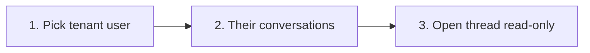

# Company Chat — Role 2 Admin Oversight (Per-User Drill-Down)

Agreed design from discussion. Not an implementation spec.

## Purpose

- **Role 2 (company admin / مدير الشركة)** needs to view internal 1:1 chats within their company for oversight or support.
- Loading **all** tenant conversations at once does not scale and is hard to use; **per-user drill-down** is the primary UX.
- Admins should **read** other users’ threads; they should **not** silently join as a participant or send messages in someone else’s conversation unless that is explicitly added later.

## Current behavior

| Area | Today |
|------|--------|
| `GET /api/chat/conversations` | Only conversations where the current user is `participant_one_id` or `participant_two_id`. |
| `ensureConversationAccess` | Same participant check on messages, attachments, read, and WebSocket. |
| Role 2 extras | Can **post** to the **broadcasts** channel only (`ADMIN_ROLE_ID = 2` in `src/chat-module-api.ts`). |
| Isolation tests | Same-tenant user who is **not** a participant cannot list or open a thread (`tests/chat-isolation.test.ts`). |

Broadcasts are for company-wide announcements, not a substitute for inspecting private DMs.

## Why per-user drill-down (not a flat “all chats” inbox)

1. **Matches admin mental model** — “What is Ahmed discussing?” not “Show conversation #847.”
2. **Scales** — For one selected user, at most `N − 1` threads (pairs they are in), not `N × (N − 1) / 2` company-wide.
3. **Simpler UI** — Reuse tenant user list, then a short conversation list, then thread view.
4. **Clearer policy** — Oversight is framed as viewing chats **for a specific employee**, not one endless company feed.

A tenant-wide paginated “all recent activity” view remains optional as **phase 2** if needed for compliance or cross-user search.

## User flow (role 2 on `/admin/chat`)



1. **Users** — List active users in the tenant (existing `GET /api/chat/users` or dedicated admin list).
2. **Conversations** — List threads where the selected user is a participant, sorted by `last_message_at` DESC.
3. **Thread** — Paginated message history; composer hidden or disabled with a clear “read-only oversight” label.

The **bottom-right widget** stays on the admin’s **own** chats only. Drill-down lives on the full **`/admin/chat`** page.

## API (conceptual)

### List conversations for a selected user

`GET /api/chat/admin/users/:userId/conversations`

- **Auth:** `role_id = 2`, same `tenant_id` as target user.
- **Query:** optional `limit` (default 50, cap 100), `cursor` / `before` on `last_message_at`, optional `active_days` (e.g. 30).
- **SQL shape:**

```sql
SELECT c.id, c.participant_one_id, c.participant_two_id,
       c.last_message_at, c.last_message_id
FROM chat_conversations c
WHERE c.tenant_id = ?
  AND (c.participant_one_id = ? OR c.participant_two_id = ?)
ORDER BY COALESCE(c.last_message_at, c.created_at) DESC
LIMIT ?
```

- **Response:** each row includes **both** participants and **the other party** relative to the selected user (not `other_user` relative to the admin). Include a short `last_message` preview.
- **Performance:** one query with JOINs for participant names and last message — avoid the per-row N+1 pattern in the current `GET /api/chat/conversations` handler.

### Read messages / WebSocket

- Extend access checks so role 2 can **read** any conversation in their tenant when the conversation involves a user they are allowed to inspect (via drill-down).
- **POST** message, attachment, and **read** cursor updates remain **participant-only** unless product explicitly allows admin replies.
- **WebSocket:** connect only for the **one** conversation currently open — do not subscribe to every company thread.

### Errors

- Target `userId` not in tenant → `404`.
- Caller not role 2 → `403`.
- Other roles unchanged (participant-only).

## Access control summary

| Action | Role 2 | Role 4/5 (etc.) |
|--------|--------|------------------|
| List own conversations | Yes | Yes |
| List another user’s conversations (admin endpoint) | Yes, same tenant | No |
| Read messages in others’ threads | Yes (read-only) | No |
| Send in others’ threads | No (default) | No |
| Post broadcasts | Yes | No |

`tenant_id` must be enforced on every query. No cross-tenant access.

Customer tags in messages continue to use **`canUserAccessCustomer`** per viewer when rendering `can_link` / `customer_id`.

## UI notes

- Section label: e.g. **“Company chats”** vs **“My chats”** for role 2.
- Banner when viewing a thread: *Viewing chats for {name} (read-only)*.
- Conversation row: **{other participant name}** + last message snippet + time.
- Optional: filter “Active in last 30 days” on the per-user list.

## Scale (reference)

| Company users | Max pairs company-wide | Max pairs per selected user |
|---------------|------------------------|-----------------------------|
| 50 | ~1,225 | 49 |
| 100 | ~4,950 | 99 |

Per-user lists stay small; pagination is optional for very active employees.

## Phase 2 (optional, not required for v1)

- `GET /api/chat/admin/conversations` — tenant-wide, cursor-paginated, search by participant name, default `active_days=30`.
- Audit export (CSV) for compliance instead of live UI over full history.

## Implementation checklist

- [ ] `ensureConversationAccess` (or split read/write helpers) — role 2 + tenant match for **read**; keep write participant-only.
- [ ] `GET /api/chat/admin/users/:userId/conversations` — role 2, batched SQL.
- [ ] `/admin/chat` — drill-down UI for `roleId === 2`; read-only thread view.
- [ ] Tests: role 2 sees target user’s convs; role 4 cannot; role 2 cannot POST in others’ threads; tenant isolation unchanged.

## Privacy

Company admins viewing employee DMs is sensitive. Document in product/release notes. Display read-only oversight in the UI so behavior is transparent.

## Related docs

- [`company-chat-system-plan.md`](company-chat-system-plan.md) — original chat architecture.
- [`company-chat-customer-tags.md`](company-chat-customer-tags.md) — customer `@` tagging and RBAC.
- [`src/chat-module-api.ts`](src/chat-module-api.ts) — current API and `ADMIN_ROLE_ID`.
