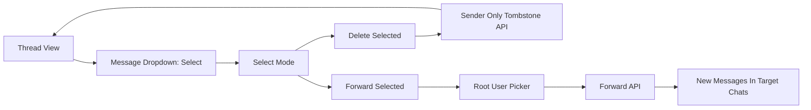

# Company Chat — Select, Delete, Forward (Agreed Design)

Decisions from design discussion. Not an implementation spec.

## Purpose

- Let users select one or more messages in a thread (direct chat or broadcast channel).
- **Delete** selected messages they sent (tombstone: content removed, original timestamp kept).
- **Forward** selected messages (text, images, documents) to one or more users via the chat root user picker.

## Scope

Implement across both chat surfaces:

- `src/chat-widget.ts` — floating chat widget
- `src/chat-page.ts` — full chat page
- `src/chat-module-api.ts` — direct chat, broadcast, delete, and forward APIs

Schema: `migrations/0078_company_chat.sql` and `migrations/0082_chat_broadcasts.sql` already define `deleted_at` on messages and broadcasts. Add a new migration only if forwarding needs audit fields (e.g. `forwarded_from_message_id`).

## Product rules

| Rule | Choice |
|------|--------|
| Who can delete | **Sender only** — users tombstone only messages they sent |
| Broadcasts | **Included** — select/delete/forward applies to admin announcement messages too |
| Deleted appearance | Row stays in thread; body/attachment cleared; UI shows **deleted** placeholder; **`created_at` unchanged** |
| Forward targets | One or more users from tenant user list (`/api/chat/users`) |
| Forward content | Text, images, and documents |

## UI behavior

### Per-message menu

- Each message bubble has a compact arrow/dropdown at the end.
- Menu includes **Select**, which enters **select mode**.

### Select mode

- Checkboxes appear before each bubble (start side in RTL).
- Multiple bubbles can be selected.
- Thread header (where close / expand / back live) shows:
  - Cancel / back
  - Selected count
  - **Delete** icon
  - **Forward** icon
- Hide or disable **Delete** when any selected message was not sent by the current user.

### Deleted messages

- No body, image, document link, customer tags, or dropdown menu.
- Muted **deleted** label plus original timestamp.

### Forward flow

1. User selects messages and taps **Forward**.
2. Client stores pending forward payload and returns to **root** (conversation list / user picker).
3. User picker shows multi-select checkboxes (not single-click open thread).
4. User picks one or more recipients and confirms.
5. Client calls forward API, clears select/forward state.
6. Default: stay on root with success feedback (do not auto-open first target chat).



## Backend — Delete

### Endpoints

- `POST /api/chat/conversations/:id/messages/delete` — body: `{ message_ids: number[] }`
- `POST /api/chat/broadcasts/messages/delete` — body: `{ message_ids: number[] }`

### Behavior

- Direct: `ensureConversationAccess` on conversation.
- Broadcast: tenant access; sender-only delete on `chat_broadcasts.sender_id`.
- Per message: set `deleted_at`, clear `body` and `attachment_json`, keep `created_at`.
- Optional: delete R2 object after wipe.
- Reject attachment download when message has `deleted_at`.
- WebSocket: `message_deleted` / `broadcast_deleted` so open clients update without polling.

### Query changes

- **History** (direct + broadcast): return deleted rows (do not filter `deleted_at IS NULL`).
- **Unread counts**: continue excluding deleted messages.
- **Conversation list preview**: if `last_message_id` points at a deleted row, show tombstone snippet or recompute from latest non-deleted message.

## Backend — Forward

### Endpoint

- `POST /api/chat/messages/forward`

### Body

```json
{
  "source_type": "direct" | "broadcast",
  "source_conversation_id": 123,
  "message_ids": [1, 2],
  "recipient_user_ids": [4, 5]
}
```

- `source_conversation_id` required when `source_type` is `direct`.
- Reject deleted source messages.
- For each recipient: same-tenant check → create/reuse direct conversation → insert new message(s) as forwarder with new `created_at`.
- **Text:** copy `body`; copy customer tags via existing tag insert + `filterTaggableCustomers`.
- **Attachments:** copy R2 object to `chat/{tenantId}/{targetConvId}/{newMsgId}/{filename}`; new `attachment_json`; do not reuse source message id in key.
- Side effects: existing `broadcastToRoom` + `pushUserNotification` per target conversation.

## Testing (when implemented)

### Backend

- Direct delete: sender ok; peer forbidden; deleted row in history with same `created_at`.
- Attachment delete: download 404 after tombstone.
- Broadcast delete: sender ok; non-sender forbidden.
- Forward to multiple users (text + attachment).
- Forward broadcast → direct.
- Reject deleted sources and cross-tenant recipients.

### UI

- `tests/chat-script-syntax.test.ts` after inline script changes.
- Optional string/DOM checks for select-mode controls and deleted placeholder.

### Commands

```bash
npm test -- chat-isolation
npm test -- chat-broadcasts
npm test -- chat-message-delete
npm test -- chat-message-forward
npm test -- chat-script-syntax
```

## Manual smoke test

- Widget + full page: direct text, image, doc.
- Broadcast: select, delete (own messages), forward to multiple users.
