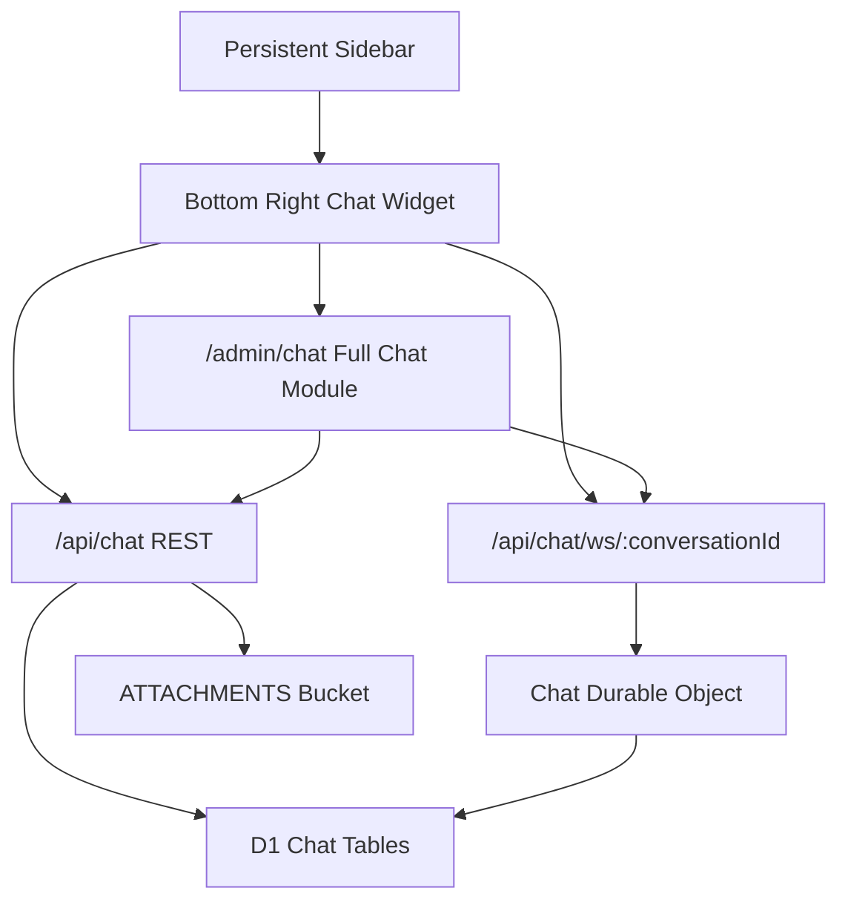

# Company Chat System Plan

## Architecture

Use D1 as the durable source of truth, R2 for chat attachments, and a Cloudflare Durable Object as the live WebSocket fan-out point per conversation. The current app is a Hono Cloudflare Pages worker in [`src/index.tsx`](src/index.tsx), so the chat backend should be added as a small module and registered from the main entry instead of expanding the large file further.

## Data Model

Add a new migration, likely [`migrations/0078_company_chat.sql`](migrations/0078_company_chat.sql), with:

- `chat_conversations`: direct conversation metadata scoped by `tenant_id`; unique pair for `participant_one_id` and `participant_two_id`.
- `chat_messages`: message body, sender, timestamps, optional attachment metadata JSON, soft delete flags.
- `chat_message_reads`: per-user read cursor/read timestamp for unread counts.
- Indexes on `tenant_id`, participant pairs, `conversation_id + created_at`, and unread lookup paths.

Attachments should reuse the existing `ATTACHMENTS` R2 binding from [`wrangler.toml`](wrangler.toml), storing objects under a chat-specific prefix such as `chat/{tenantId}/{conversationId}/{messageId}/...`.

## Backend Work

Create a new module such as [`src/chat-module-api.ts`](src/chat-module-api.ts) and register it from [`src/index.tsx`](src/index.tsx). It should reuse the existing `getUserInfo(c)` auth pattern and enforce tenant isolation on every query.

Planned endpoints:

- `GET /api/chat/users`: list active users in the current company available for direct chat.
- `GET /api/chat/conversations`: current user's conversations with last message, unread count, and participant info.
- `POST /api/chat/conversations/direct`: create or fetch a 1-to-1 conversation with another tenant user.
- `GET /api/chat/conversations/:id/messages`: paginated message history.
- `POST /api/chat/conversations/:id/messages`: create a text message and broadcast it.
- `POST /api/chat/conversations/:id/attachments`: upload attachment to R2, create/send attachment message or draft metadata.
- `POST /api/chat/conversations/:id/read`: update read cursor.
- `GET /api/chat/ws/:conversationId`: WebSocket upgrade endpoint bound to the conversation Durable Object.

Add a Durable Object class, for example `ChatConversationRoom`, exported from [`src/index.tsx`](src/index.tsx) or a dedicated file imported by it. It will validate the user on connect, keep only authorized tenant participants connected, broadcast new message/read events, and rely on D1 for persistence.

Update [`wrangler.toml`](wrangler.toml) with a Durable Object binding, for example `CHAT_ROOMS`, plus a Durable Object migration tag. The same binding should be mirrored in local config if the repo uses [`wrangler.docker.toml`](wrangler.docker.toml) for local development.

## UI Work

Extract the chat UI injection into a dedicated file such as [`src/chat-widget.ts`](src/chat-widget.ts) so [`injectPersistentAdminSidebar`](src/index.tsx) only calls a helper. The helper will add:

- A chat button near the bottom of the persistent sidebar, above logout.
- A fixed bottom-right compact chat window with conversation list, active thread, unread badges, attachment button, and reconnect state.
- A maximize control linking to or opening `/admin/chat`.
- Client-side WebSocket handling with fallback messaging for disconnected state.

Create a full chat page such as [`src/chat-page.ts`](src/chat-page.ts), served by `GET /admin/chat`, using the same API/client logic but with a larger two-column layout for conversations and message history.

Add `/admin/chat` to `PERSISTENT_SIDEBAR_ALLOWED_LINKS` in [`src/index.tsx`](src/index.tsx) for roles that should use company chat, probably roles 1-5 unless you want to exclude bank agents from tenant chat.

Because [`injectPersistentAdminSidebar`](src/index.tsx) currently skips `/admin/contracts`, the first implementation can show chat on normal admin pages and `/admin/chat`; a follow-up can add the widget to the contracts module layout if you want chat visible there too.

## Security And Permissions

- Only allow conversations between users in the same `tenant_id`; super-admin access should still be explicit, not cross-tenant by accident.
- Verify both participants on every REST call and WebSocket connection.
- Limit attachment size and MIME types, likely images/PDFs/common documents.
- Store attachment metadata in D1 and stream files from R2 through authenticated endpoints rather than exposing raw public object URLs.
- Avoid trusting client-supplied sender IDs, tenant IDs, read state, or conversation IDs.

## Testing And Verification

Add focused tests around the D1/API layer, likely extending the existing Node test setup under [`tests/`](tests/):

- Tenant isolation: user cannot list or open another company’s conversations.
- Direct conversation uniqueness: same two users reuse one conversation.
- Message pagination and unread counts.
- Attachment metadata authorization.

Manual verification should cover two logged-in users in the same tenant: open widget, start a chat, send text, send an attachment, verify live delivery, refresh to confirm history, mark read, and maximize into `/admin/chat`.